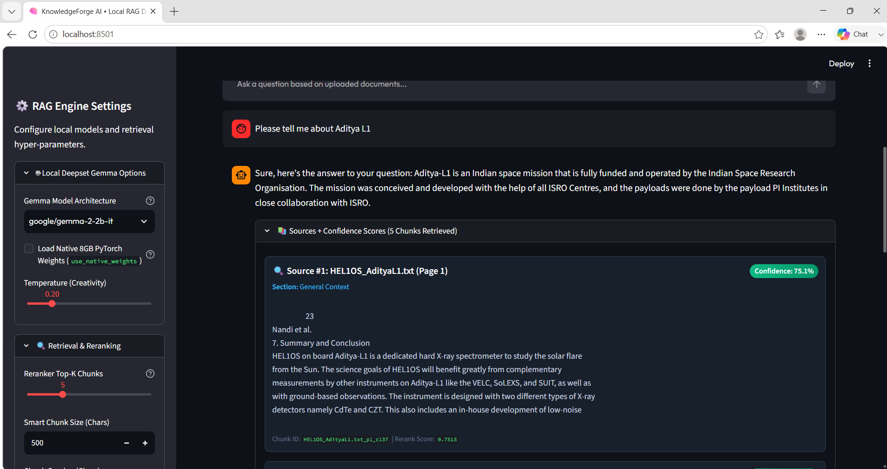
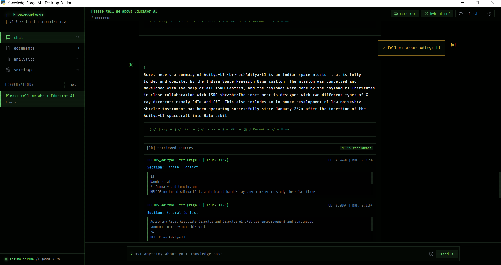
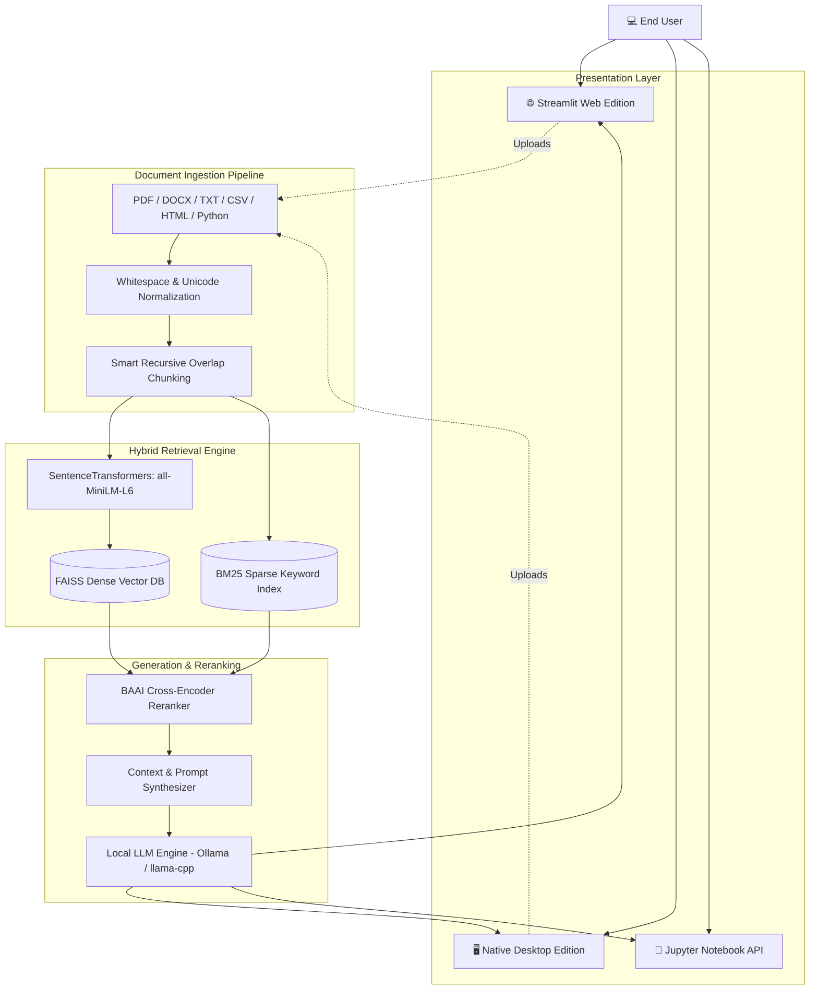

<div align="center">
  
  
  
  
  
</div>

<br>

<h1 align="center">KnowledgeForge AI 🧠</h1>
<h3 align="center">RAG and Ready for Your Command. A Production-Grade, 100% Offline Retrieval-Augmented Generation Ecosystem.</h3>

<div align="center">
  <b>Developed by Ranadeep Saha</b> <br>
  <i>Full Stack Developer | Member of Google Developer Group</i> <br>
  <a href="https://www.linkedin.com/in/ranadeep-saha-a03296404">LinkedIn</a> • <a href="mailto:ranadeep2021saha@gmail.com">ranadeep2021saha@gmail.com</a> • <a href="https://github.com/unknown404-practice/KnowledgeForge-AI">GitHub Repository</a>
</div>

---

## 🌟 Executive Summary

**KnowledgeForge AI** is a production-grade, end-to-end RAG (Retrieval-Augmented Generation) architecture designed for extreme retrieval accuracy, absolute privacy, and cross-platform native execution. 

This is not a prototype—it is a robust, battle-tested pipeline that strictly enforces a 100% local, air-gapped data environment. It leverages zero-latency **FAISS** Dense Vector lookups merged with **BM25** Sparse retrieval, contextual **Cross-Encoder** re-ranking, and dynamic execution across a **Native Desktop Edition**, a **Streamlit Web Dashboard**, and a **Programmatic Jupyter Notebook API**.

<div align="center">
  <table>
    <tr>
      <td align="center"><b>Web Edition Dashboard</b></td>
      <td align="center"><b>Native Desktop Edition</b></td>
    </tr>
    <tr>
      <td></td>
      <td></td>
    </tr>
  </table>
</div>

---

## 🛠️ Technological Arsenal

KnowledgeForge AI uses a highly optimized, modern Python-centric stack:

| Layer | Technology Used | Description |
| :--- | :--- | :--- |
| **Language** | `Python 3.13` | Core logic, concurrency, and API abstractions. |
| **Web UI** | `Streamlit` | High-performance, reactive web dashboard interface. |
| **Desktop UI** | `PyWebView` + `HTML/JS/CSS` | Native Windows executable wrapper rendering a custom DOM. |
| **Vector Engine** | `FAISS` (CPU) | High-speed dense vector similarity search. |
| **Sparse Search** | `BM25` (rank-bm25) | Keyword-based BM25 algorithm for Hybrid Retrieval. |
| **Embeddings** | `SentenceTransformers` | Uses `all-MiniLM-L6-v2` for generating rich semantic vectors. |
| **Reranker** | `BAAI/bge-reranker-base` | Heavy-duty Cross-Encoder for extreme contextual accuracy. |
| **LLM Inference** | `Ollama` + `llama-cpp` | GGUF Quantized inference (Gemma / Llama / Qwen). |
| **Parsing** | `PyMuPDF` / `python-docx` | Extracts text and layout data from PDF, DOCX, TXT, HTML, CSV. |

---

## 🏗️ System Architecture & Block Diagram



---

## 🚀 Setup & Installation Guide

KnowledgeForge AI provides a foolproof startup sequence. It can be run fully containerized via Docker or natively on your host machine.

### Prerequisites
- **Git** installed on your system.
- **Python 3.10+** (Python 3.13 recommended).
- **Ollama** installed locally (if running natively).
- **Docker & Docker Compose** (if running containerized).

### Step 1: Clone the Repository
```bash
git clone https://github.com/unknown404-practice/KnowledgeForge-AI.git
cd KnowledgeForge-AI
```

### Option A: The "One-Click" Docker Deployment (Recommended)
This method perfectly sandboxes the environment and bypasses any local OS dependency issues.

```bash
# Build and boot the entire stack in detached mode
docker-compose up -d --build
```
*The web edition will immediately become available at `http://localhost:8501`.*

### Option B: Native Host Installation
If you prefer to run the system directly on your OS to access the Native Desktop App or Jupyter Notebooks:

```bash
# 1. Create a virtual environment
python -m venv venv

# 2. Activate it (Windows)
venv\Scripts\activate

# 3. Install all dependencies
pip install -r requirements.txt
```

---

## 🖥️ Running the Applications

KnowledgeForge AI features three distinct ways to interface with the RAG engine.

### 1. Web Edition (Streamlit Dashboard)
The Web Edition provides a beautiful, responsive dashboard for managing documents and chatting.
```bash
# Make sure Ollama is running in the background!
ollama serve

# Start the Streamlit server
python -m streamlit run app/main.py
```
> 🌐 **Access at:** `http://localhost:8501`

### 2. Native Desktop Edition (PyWebView)
The Desktop Edition mounts a custom HTML/CSS/JS frontend onto a standalone OS window, piping requests natively into the Python backend without requiring a browser.

**To run:**
Simply double-click the `Open_in_Desktop_App.bat` file in the project root, or execute:
```bash
python app/desktop.py
```
> 🖥️ A native desktop window will instantly appear on your screen!

### 3. Programmatic API (Jupyter Notebook)
For developers who want to test the raw programmatic logic of the FAISS engine, Hybrid Retriever, and Cross-Encoder without any UI overhead.

**To run:**
1. Open Visual Studio Code or JupyterLab.
2. Navigate to `notebooks/Hackathon_API_Tutorial.ipynb`.
3. Execute the cells sequentially to see the backend engine fetch metadata, compute confidence scores, and stream outputs directly to the console!

---

## 🛡️ "Foolproof" Fault Tolerance
To ensure the smoothest experience for users, KnowledgeForge AI features a **Global Try-Catch Shield**. 
If a user forgets to launch the `Ollama` daemon, or if their system blocks port `11434`, the application **will not crash**. Instead, the UI will intercept the connection failure and gracefully render a welcoming Markdown guide directly into the chat interface instructing the user on how to boot the backend. 

Additionally, if strict firewalls block local port binding entirely, users can enable `use_native_weights=True` in the Python configuration to seamlessly drop down into an embedded `llama-cpp-python` engine that runs inference 100% inside the Python RAM—bypassing the host's networking layer entirely.

---

## 📄 License
This project is officially licensed under the **Apache License 2.0**. See the [LICENSE](LICENSE) file for complete details.

<div align="center">
  <br>
  <i>Built with ❤️ to attend your every command</i>
</div>
